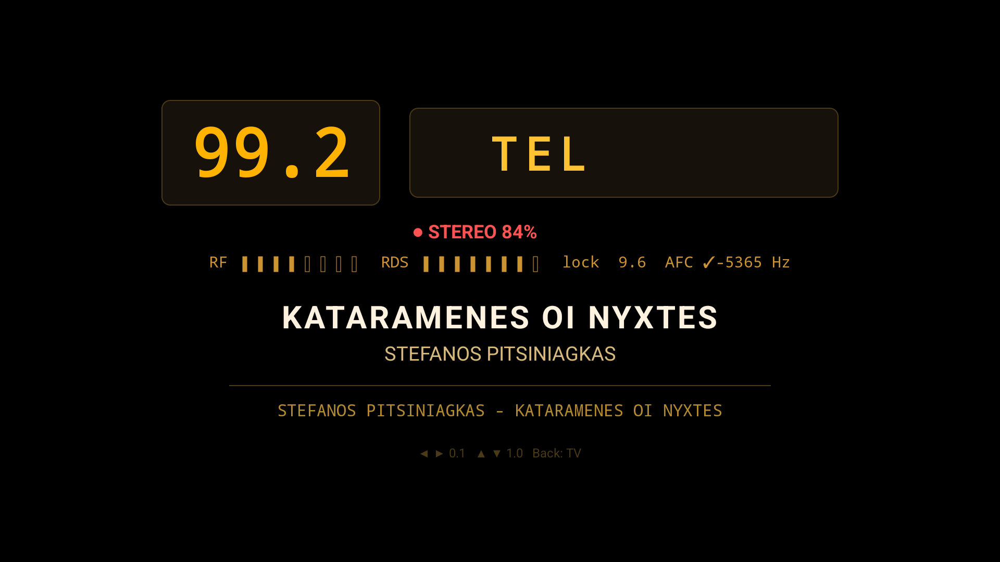

# DVB-T TV & FM Radio for Android — RTL2832U / RTL-SDR

Turn a cheap RTL2832U USB stick into a complete **terrestrial TV receiver and
FM radio with full RDS** on any Android TV box or phone (USB OTG). No root,
no kernel drivers — everything runs in userspace.

*The FM panel: vintage dot-matrix display with live RT+ now-playing metadata
(song title & artist), 8-character PS frame display, stereo blend indicator
and signal bargraphs — decoded from plain FM broadcast by a $15 dongle.*

## Features

### DVB-T television
- Full channel scan (PAT/PMT/SDT/NIT) with real LCNs, ISO-8859-7 names
- Hardware-accelerated playback via libVLC (MediaCodec), 1080i tested
- EPG (EIT now/next + schedule browsing), subtitles toggle, channel zapping
- Radio services included in the channel list (audio + now-playing metadata)

### FM radio (SDR mode)
- Wideband FM with the proven rtl_fm recipe (high-rate capture, fs/4 offset
  tuning to dodge the zero-IF DC spike, 171 kHz MPX — 3×57k, integer RDS math)
- **Stereo with signal-driven blend** — modeled on classic car-radio chips
  (Philips TDA1591 SNC, Sanyo LA1888NM): gradual mono↔stereo transition driven
  by RSSI with asymmetric dynamics (fast to mono on signal drops, slow back),
  so weak stations never turn into a hiss bath. To our knowledge no other
  open-source SDR implements blend.
- **Full RDS decoder**, built from the standards and vintage chip datasheets:
  - Carrier recovery: fixed 57 kHz mix → narrow LPF → Costas loop with
    gear-shifted bandwidth, FFT-based frequency acquisition (Hann, quality gate)
  - Carrier-slaved symbol clock (encoder derives bit clock from the same
    oscillator — so do we)
  - Block layer per SAA6588 receiver-chip practice: flywheel sync hold,
    any-pair sync, ±1 bit-slip recovery, burst-error FEC with per-block
    correction classes (text only from lightly-corrected blocks)
  - PS as an 8-char frame display per NRSC-G300 (no reassembly heuristics),
    confirm-or-timeout publishing with chimera protection, RadioText with
    cumulative assembly and A/B-flag framing, CT clock (error-free groups only)
  - **RT+ (RadioText Plus)**: ODA 3A registration (AID 0x4BD7) → tagged song
    Title/Artist on their own quasi-static lines — the "MP3-player feel" found
    in BMW/Toyota head units
- **AFC**: acquire→lock FSM modeled on SDRangel's frequency tracker —
  hardware micro-retune for coarse acquisition, then a digital NCO smoothly
  follows the transmitter (drifting analog exciters included), zero audio
  glitches
- Per-tuner RF gain in real dB (R820T/FC0012/E4K/FC0013 tables), remote-key
  gain stepping, manual gain by design (the R820T hardware AGC pumps and
  splatters on FM — measured, not guessed)
- Dual-stick support with **functional role detection**: on startup the app
  probes which stick locks DVB-T — that one has the TV antenna, the other gets
  FM. Identity follows the antenna, survives replugging, self-heals.
- Vintage dot-matrix UI: amber display windows, red STEREO / green mono lamp,
  signal bargraphs

## Hardware

- RTL2832U USB stick (RTL-SDR). Tested: R820T (recommended) and FC0012 tuners
- Android 7.0+ device with USB OTG / USB host (TV boxes work great)
- For simultaneous-style TV/FM switching with two sticks: a powered OTG hub

Note: DVB-T demodulation runs in the RTL2832's hardware (as designed); FM is
true SDR — raw I/Q via rtl_tcp, all demodulation in Kotlin on the device
(~1 core of a low-end TV box for FM + stereo + RDS).

## Install (prebuilt APK — no compiling needed)

1. Download the latest `dvb-fm-android-*.apk` from
   [Releases](https://github.com/pantgr/dvb-fm-android/releases)
2. On the Android device allow **Install from unknown sources**
   (Settings → Security, or per-app prompt on Android 8+)
3. Install the APK — via file manager / USB stick, or from a PC:
   `adb install dvb-fm-android-v1.0.apk`
4. Plug the RTL2832U stick into the USB OTG port (TV boxes: any USB port,
   ideally a powered hub) and open **Επίγεια TV**
5. Grant the USB permission when Android asks
6. **TV**: run a channel scan from the channel list (first start).
   **FM**: press the FM button, tune with ◀ ▶ / ▲ ▼ or type the frequency
   with the digit keys (e.g. `984` → 98.4 MHz)

The APK is debug-signed (hobby project) — Play Protect may warn on first
install; that is expected for any sideloaded debug build.

## Build from source

- JDK 17, Android SDK 34, NDK 26.1, CMake 3.22 (native usbxfer + librtlsdr)
- Set `JAVA_HOME` (or `org.gradle.java.home` in `gradle.properties`), put
  `sdk.dir` in `local.properties`
- `./gradlew :app:assembleDebug`

## Keys (TV remote / D-pad)

| Key | TV mode | FM mode |
|---|---|---|
| ◀ ▶ | — | tune ±0.1 MHz |
| ▲ ▼ | zap channel | tune ±1.0 MHz |
| CH± | zap channel | RF gain ± |
| OK | info banner / EPG | — |
| MENU | subtitles | RF gain + |
| digits | channel number | frequency (e.g. 984 → 98.4) |
| Back | list / exit | back to TV |

## Architecture notes

The FM side uses a **raw hub** design borrowed from car-radio IC block
diagrams: one owner of the device produces a single raw MPX ring buffer;
audio (stereo decoder) and RDS are independent subscribers with their own
filters and threads. A slow consumer drops its own samples and can never
stall the producer — the stereo path structurally cannot degrade RDS.

Comments in the source are currently in Greek (the project grew up bilingual);
translations are welcome — the code itself tells the story in plain Kotlin.

## Built on the shoulders of

- [signalwareltd/AndroidDvbDriver](https://github.com/signalwareltd/AndroidDvbDriver) — userspace DVB driver (GPLv2)
- [martinmarinov/rtl_tcp_andro-](https://github.com/martinmarinov/rtl_tcp_andro-) — rtl_tcp for Android (GPLv2)
- [rtl-sdr-blog/rtl-sdr-blog](https://github.com/rtlsdrblog/rtl-sdr-blog) — modern librtlsdr (GPLv2)
- [VideoLAN libVLC](https://www.videolan.org/vlc/libvlc.html) — playback
- [f4exb/sdrangel](https://github.com/f4exb/sdrangel) — the FLL that inspired our AFC
- [windytan/redsea](https://github.com/windytan/redsea) — reference RDS decoder used as test oracle
- Standards & datasheets studied page by page: EN 50067 / IEC 62106,
  NRSC-G300, Silicon Labs AN243, EBU tech review 307 (RT+), and the glorious
  service manuals of the Philips SAA6588, TDA1591 and Sanyo LA1888NM

## License

GPL-2.0 — same as the vendored drivers this project stands on. See `LICENSE`.

Use a legal antenna setup and respect your local broadcast regulations.
Built with love, measurement instruments, and a pair of magic eye tubes. 📻
